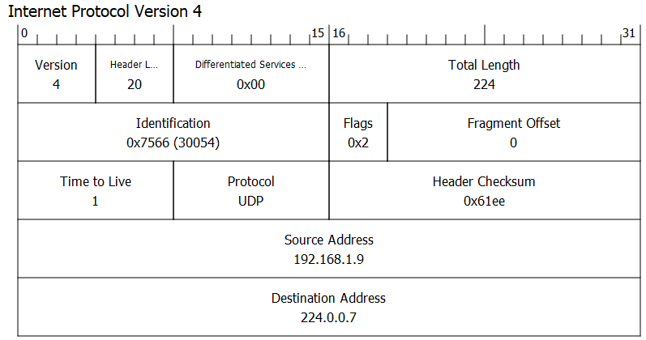
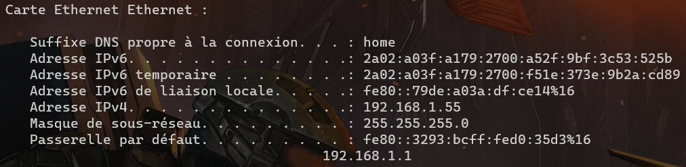
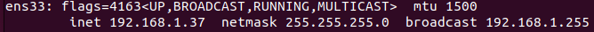
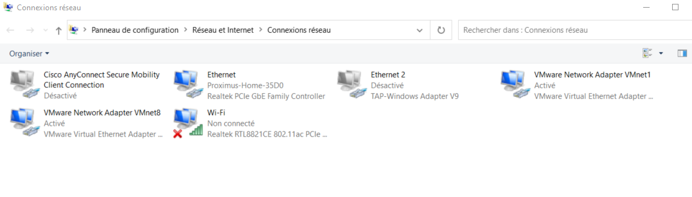
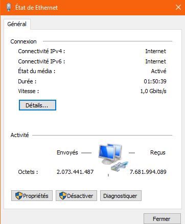
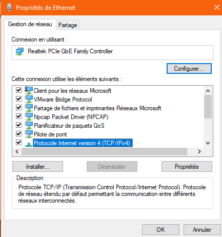

# Adresse IP

## Format

```
192.168.1.100
11000000.10101000.00000001.01100100
```

L'adresse ip possède une taille de 32 bits soit 4 octets.

Chaque octet est affiché individuellement et est séparé des autres octets par un point.

## Utilité

Permet d'identifier une machine sur un réseau (plus précisément, elle permet d'identifier une interface réseau d'une machine).

Permet par conséquent de communiquer avec des machines sur le réseau.

## Masque de Sous-réseau

Deux parties sur une adresse IP:

1. La partie réseau
2. La partie hôte

```
192.168.1.100 /24
/24 => 255.255.255.0 => 11111111.11111111.11111111.00000000
192.168.1.100 => 11000000.10101000.00000001.01100100
/24 => [11111111.11111111.11111111 : 24 bits pour le réseau].[00000000 => (32 - 24) bits pour les hôtes (8 bits d'hôtes)]

Il faut effectuer un ET logique entre l'adresse ip et son masque pour obtenir l'adresse ip du réseau
11000000.10101000.00000001.01100100
&
11111111.11111111.11111111.00000000
11000000.10101000.00000001.00000000 => 192.168.1.0 = adresse réseau

Il faut effectuer un ET logique entre l'adresse ip et le complément à 1 de son masque pour obtenir la partie hôte de l'adresse ip
11000000.10101000.00000001.01100100
&
00000000.00000000.00000000.11111111
00000000.00000000.00000000.01100100 => 0.0.0.100 = l'hôte est le 100e hôte du réseau

Imaginons qu'on nous demande de découper notre adresse 192.168.1.0 en 3 sous-réseaux
1 pour le département RH
1 pour le département IT
1 pour le département management
[11000000.10101000.00000001].00000000
3 sous-réseaux
quelle est la puissance de deux dans laquelle on peut mettre 3 ?
autrement dit, sur combien de bits peut-on stocker le chiffre 3 ?
2 bits car 2^2 = 4 et 4 > 3
OU alors: log_2(3) = 1.58496250072 => ceil(log(3, 2)) => 2

>>>
def how_many_bits(net_num):
    return ceil(log(net_num, 2))
<<<

A quelle puissance faut-il élever 2 pour atteindre 3 ?
par contre si on utilise que 1 bit => 2^1 = 2 et 2 < 3; on ne peut stocker 3 réseau sur 1 bit
prenons donc 2 bits de la partie hôte de notre adresse afin de définir nos sous-réseaux
[11000000.10101000.00000001].[00]000000

1er sous-réseau:
[11000000.10101000.00000001].[00]000000
réseau: 192.168.1.0 /26 (on a rajouté deux bits au masque initial)
broadcast: 192.168.1.63 => [11000000.10101000.00000001].[00]111111
gateway: 192.168.1.62 ou 192.168.1.1
hôtes: 6 bits pour les hôtes => 2^6 - (broadcast + réseau) = 64 - 2 = 62 hôtes

2e sous-réseau:
[11000000.10101000.00000001].[01]000000
réseau: 192.168.1.64 /26 (on a rajouté deux bits au masque initial)
broadcast: 192.168.1.127 => [11000000.10101000.00000001].[01]111111
gateway: 192.168.1.126 ou 192.168.1.65
hôtes: 6 bits pour les hôtes => 2^6 - (broadcast + réseau) = 64 - 2 = 62 hôtes

3e sous-réseau:
[11000000.10101000.00000001].[10]000000
réseau: 192.168.1.128 /26 (on a rajouté deux bits au masque initial)
broadcast: 192.168.1.191 => [11000000.10101000.00000001].[10]111111
gateway: 192.168.1.190 ou 192.168.1.129
hôtes: 6 bits pour les hôtes => 2^6 - (broadcast + réseau) = 64 - 2 = 62 hôtes

Sous-réseau non utilisé:
[11000000.10101000.00000001].[11]000000
réseau: 192.168.1.192 /26 (on a rajouté deux bits au masque initial)
broadcast: 192.168.1.255 => [11000000.10101000.00000001].[11]111111
gateway: 192.168.1.254 ou 192.168.1.193
hôtes: 6 bits pour les hôtes => 2^6 - (broadcast + réseau) = 64 - 2 = 62 hôtes

Si on regarde la première adresse réseau : 192.168.1.0
Et la dernière adresse de broadcast : 192.168.1.255
On a bien couvert l'ensemble du /24 de départ (si on compte utiliser le 4e réseau)
```

Dans un réseau il y a différentes adresses:

1. L'adresse réseau

   Elle est obtenue en faisant un ET logique entre l'adresse d'un quelconque hôte du réseau et son masque

   ```
   192.168.1.100
   &
   255.255.255.0 (/24)
   192.168.1.0
   ```

   C'est la première adresse ip d'un réseau

   On peut également l'obtenir en mettant tous les bits de la partie hôte de l'adresse à 0

2. L'adresse de broadcast

   C'est la dernière adresse ip d'un réseau

   On peut l'obtenir en mettant tous les bits de la partie hôte de l'adresse à 1

   ```
   pour le réseau 192.168.1.0 /24
   l'adresse de broadcast est 192.168.1.255
   ```

   Permet d'envoyer des données à toutes les machines du réseau à la fois

   Ne traverse pas les routeurs sauf exception

3. L'adresse du default gateway

   La gateway est l'ip par laquelle les machines du réseau vont devoir communiquer afin qu'elles puissent atteindre des machines d'un autre réseau

   C'est le pont entre notre réseau et des réseaux externes

   La gateway est en général l'adresse ip de l'interface réseau d'un routeur

   Lorsque ce dernier reçoit des paquets provenant du réseau interne, il va s'occuper de les acheminer vers des réseaux externes.

   Par convention, l'adresse ip de la gateway est soit la première adresse du réseau, soit l'avant dernière (celle précédent l'adresse de broadcast)

   Par exemple:

   ```
   pour le réseau 192.168.1.0 /24
   la gateway pourrait être 192.168.1.1 (Proximus)
   ou alors 192.168.1.254
   ```

   On peut lui attribuer n'importe quelle adresse mais par convention on fonctionne de la manière illustrée précédemment

4. Les adresses hôtes

   Les adresses n'étant pas l'adresse réseau, de broadcast ou de gateway sont donc libres d'être attribuées aux hôtes du réseau

   Par exemple:

   ```
   pour le réseau 192.168.1.0 /24
   il reste 8 bits dans la partie hôtes
   soit 00000000 => théoriquement il y a 256, hôtes (2^8)
   l'hôte 192.168.1.0 est déja pris car c'est l'adresse réseau
   l'hôte 192.168.1.1 est déja pris car c'est l'adresse de la gateway (ou 192.168.1.254 mais pas les deux)
   l'hôte 192.168.1.255 est déja pris car c'est l'adresse de broadcast
   il reste donc les adresses allant de 192.168.1.2 à 192.168.1.254 inclu => il y a donc 256 - 3 hôtes => 253 hôtes
   ```

## Classes

| Classe | Début     | Fin             | Masque | Masque          |
| ------ | --------- | --------------- | ------ | --------------- |
| A      | 0.0.0.0   | 126.255.255.255 | /8     | 255.0.0.0       |
| B      | 128.0.0.0 | 191.255.255.255 | /16    | 255.255.0.0     |
| C      | 192.0.0.0 | 223.255.255.255 | /24    | 255.255.255.0   |
| D      | 224.0.0.0 | 239.255.255.255 | /32    | 255.255.255.255 |
| E      | 240.0.0.0 | 255.255.255.255 |        |                 |

Notation obsolète car non adaptée à la taille d'internet.

Solution CIDR (Classless inter-domain routing) qui permet d'attribuer aux adresses un masque quelconque non définit par la classe.

Ceci permet d'avoir des masques de longueur variable et donc d'être plus flexible lors de la création d'un plan d'adressage.

## Plages d'adresses particulières

Plages d'adresses privées:

```
10.0.0.0 /8
172.16.0.0 /12
192.168.0.0 /16
```

Adresses de bouclage:

```
127.0.0.0 /8
```

Adresses de liaison locale:

```
169.254.0.0 /16
Attribuée par votre système d'exploitation lorsqu'il est impossible d'obtenir une adresse ip sur votre interface (lorsque le dhcp ne marche pas et lorsque aucune adresse n'est attribuée statiquement)
```

Les 3 plages d'adresse précédentes ne sont pas routables vers internet, elles ne sont utilisées que localement

Adresse multicast:

```
224.0.0.0 /4
Ces adresses sont utilisées pour de la multidiffusion (channels généraux)
```

## Structure d'un paquet ip




## Problématique de l'IPv4

Le soucis avec l'IPv4 c'est que le nombre d'adresse disponible est inférieur au nombre de machines à connecter sur internet

IPv4 => 32 bits => 2^32 adresses différentes = 4.294.967.296 adresses => c'est pas beaucoup

Il y a donc plusieurs solutions:

1. Le NAT (network address translation)

   Lorsque des paquets veulent sortir d'un réseau privé par le routeur pour aller vers internet, le routeur tranforme l'ip source privée en une adresse publique unique pour l'ensemble des hôtes du réseau privé

   Donc internet ne connait pas les ips uniques des hôtes du réseau privé mais connait leur adresses publique commune (plusieurs type de nat)

2. La récupération d'ips non utilisées

   L'adresse ip publique utilisée par notre routeur est attribuée par notre opérateur internet

   Lorsque notre activité internet est nulle, alors notre ip publique va nous être désattribuée et transmise à un autre routeur du réseau

   Une nouvelle adresse va nous être attribuée lorsque nous allons recommencer à naviguer sur internet

3. L'IPv6

   Nouveau format pour les adresses ip

   Elle ne font plus 32 bits mais 128 bits, ce qui nous fait au total 2^128 soit

   340 282 366 920 938 463 463 374 607 431 768 211 456 adresses ip (c'est beaucoup mieux)

   340 milliards de milliards de milliards de milliards

   ```
   notation hexadécimale
   2a02:a03f:a179:2700:a52f:9bf:3c53:525b
   ```

## Modèles en couches


Source: https://upload.wikimedia.org/wikipedia/commons/7/7e/Comparaison_des_mod%C3%A8les_OSI_et_TCP_IP.png


## Résumé

1. A quoi sert l'adresse ip ?

   identifier des interfaces réseaux sur un réseau

2. Format à point

3. Partie réseau et hôtes + hôtes particuliers + ipview 192.168.1.100

4. connectivité avec ICMP + Ip src et dst sur packet tracer

5. Masque de sous réseau + exercice + ipview avec out of band

6. Classfull vs CIDR

7. Plages d'adresses

8. Problématiques vs solutions (nat, récupération, ipv6)


# Pratique

## Voir sa propre adresse ip

### Windows

Windows + R

taper cmd

```bash
ipconfig
```



### Linux / mac

```bash
ifconfig OU ip addr
```



## Changer son adresse ip

### Windows

Windows + R

entrer ncpa.cpl



Double click sur votre interface réseau

Pour moi c'est Ethernet car je suis connecté à ma box en câblé

J'aurais pu me connecter en wifi également mais alors il aurait fallu que je sélectionne l'interface Wi-Fi



Cliquer sur Propriétés



Sélectionner "Protocole Internet Version 4 ..."


Changer votre ip comme bon vous semble

"Obtenir une adresse automatiquement" permet d'obtenir une adresse d'un serveur dhcp (de votre box par exemple)

### Linux / mac

```bash
sudo service network-manager stop # pas besoin sur mac
# permet de stopper le service réseau afin d'éviter qu'il ne rechange automatiquement l'adresse ip
```

```bash
sudo ip addr add 192.168.1.100/24 dev eth0
sudo ip route add default via 192.168.1.1 dev eth0 # pas obligatoire sauf si l'on veut sortir sur internet
```

Changer le add en del pour enlever l'adresse ip

Si vous voulez obtenir une adresse ip automatiquement provenant de votre box par exemple, alors faites

```bash
sudo dhclient
```

Attendez quelques secondes puis relisez votre ip et vous devriez en avoir reçu une provenant de votre box si vous y êtes connecté

## Autres

https://github.com/DetrembleurArthur/ipviewer

```python


def str_to_bytes(ip : str):
	fragments = ip.split('.')
	bytes_ip = [int(byte_str) for byte_str in fragments]
	return bytes_ip

def int_to_mask(mask_int : int):
	mask = 0
	if mask_int >= 0 and mask_int <= 32:
		for i in range(mask_int):
			mask |= 1 << (32 - i - 1)
	return mask

def int_to_bytes(ip : int):
	bytes_ip = []
	for i in range(4):
		bytes_ip.append((ip >> (24 - 8 * i)) & 0xff)
	return bytes_ip

def bytes_to_int(bytes : list[int]):
	value = 0
	value = bytes[0] << 24
	value |= bytes[1] << 16
	value |= bytes[2] << 8
	value |= bytes[3] << 0
	return value

def bytes_to_str(ip : list[int]):
	return f"{ip[0]}.{ip[1]}.{ip[2]}.{ip[3]}"

def network_address(ip : list[int], mask : list[int]):
	return [ip_byte & mask_byte for ip_byte, mask_byte in zip(ip, mask)]

def broadcast_address(ip : list[int], mask : list[int]):
	network = network_address(ip, mask)
	network_value = bytes_to_int(network)
	mask_value = bytes_to_int(mask)
	broadcast_value = network_value | ~mask_value
	return int_to_bytes(broadcast_value)

def hosts(mask : int):
	return 2**(32 - mask) - 2

while True:
	ip = input("\nip: ")
	if ip in ["exit", "quit", "/"]:
		break
	mask = input("mask: /")
	try:
		bytes_ip = str_to_bytes(ip)
		bytes_mask = int_to_bytes(int_to_mask(int(mask)))
		print("IP:", ip)
		print("MASK:", bytes_to_str(bytes_mask))
		print("NETWORK:", bytes_to_str(network_address(bytes_ip, bytes_mask)))
		print("BROADCAST:", bytes_to_str(broadcast_address(bytes_ip, bytes_mask)))
		print("HOSTS:", hosts(int(mask)), "or (without router):", hosts(int(mask)) - 1)
	except:
		print("Bad ip format")
```

